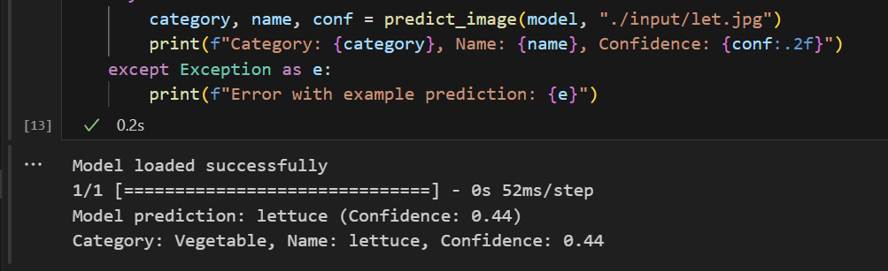

# Fruit or Veggie AI/Machine Learning Model
A deep learning image classification project that distinguishes between fruits and vegetables using a Convolutional Neural Network (CNN) built with TensorFlow and Keras. The model takes an input image and predicts whether it's a fruit or a vegetable, along with the specific name (e.g., apple, carrot, banana).

Demo Video:

